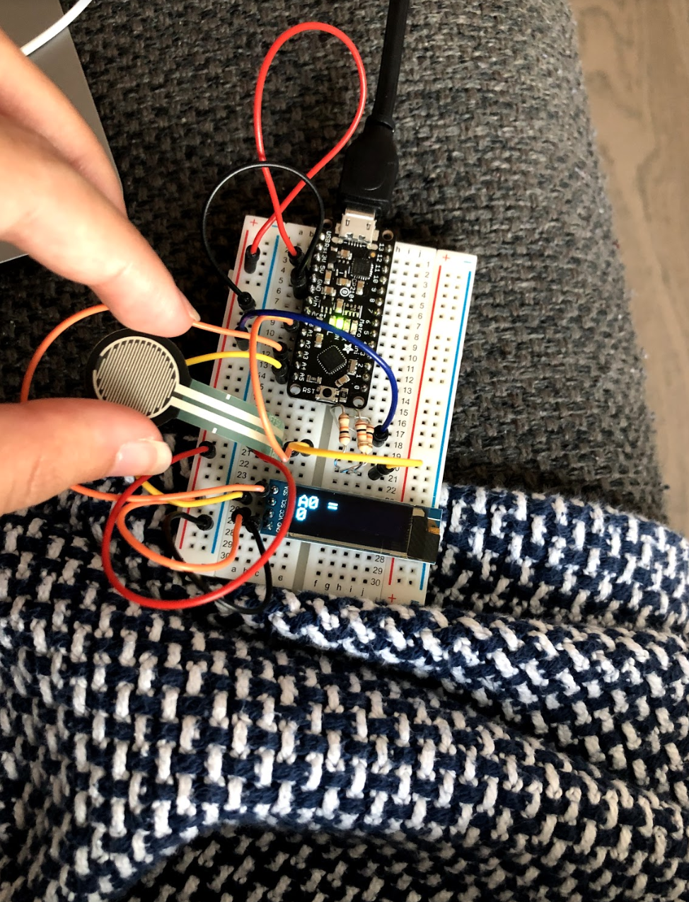

# Data Logger (and using cool sensors!)

*A lab report by Lois Lee.*


## Part A.  Writing to the Serial Monitor
 
**a. Based on the readings from the serial monitor, what is the range of the analog values being read?**

 0-1023
 
**b. How many bits of resolution does the analog to digital converter (ADC) on the Arduino have?**

10 bit, you can read this from the data sheet.

## Part B. RGB LED

**How might you use this with only the parts in your kit? Show us your solution.**

[RGB LED](https://drive.google.com/file/d/1KxOXqlaJ841rl0ghkCAZdhW91srhOFTb/view?usp=sharing)


## Part C. Voltage Varying Sensors 
 
### 1. FSR, Flex Sensor, Photo cell, Softpot

[FSR connected to LED](https://drive.google.com/file/d/1qX9i05hJwVriUb1L4Uow_C2H4xEfExVn/view?usp=sharing)

**a. What voltage values do you see from your force sensor?**

I see from 0-4 V and 0-1010 for analog value. 

**b. What kind of relationship does the voltage have as a function of the force applied? (e.g., linear?)**

Linear.

**c. Can you change the LED fading code values so that you get the full range of output voltages from the LED when using your FSR?**

I mapped the values from 0-1023 from the flex sensor to 0-255 for the LED

```  
  brightness = analogRead(A0);
  val = map(brightness, 0, 1023, 0, 255);
  analogWrite(led, val);
```

**d. What resistance do you need to have in series to get a reasonable range of voltages from each sensor?**


**e. What kind of relationship does the resistance have as a function of stimulus? (e.g., linear?)**

Linear.

### 2. Accelerometer
 
**a. Include your accelerometer read-out code in your write-up.**

[Code for RGB with accelerometer](https://github.com/lois-lee/IDD-Fa19-Lab3/blob/master/accel+disp.ino)

[Accelerometer and RGB with Display I](https://drive.google.com/file/d/1vO_NLwlGVpFAzzwcWWcIxq7nDz3DyJvq/view?usp=sharing)

[Accelerometer and RGB with Display II](https://drive.google.com/file/d/1PHEh3p-tdwJnNnu8z0y6Cf7bUc0lwdtE/view?usp=sharing)

## Optional. Graphic Display

**Take a picture of your screen working insert it here!**



[FSR + OLED Video](https://drive.google.com/file/d/1xwJhXTCkBJB-e8LdeofHwDhNpxahLR7x/view?usp=sharing)

[FSR + OLED Code](https://github.com/lois-lee/IDD-Fa19-Lab3/blob/master/fsr%2Boled.ino)

## Part D. Logging values to the EEPROM and reading them back
 
### 1. Reading and writing values to the Arduino EEPROM

**a. Does it matter what actions are assigned to which state? Why?**

Not really, there would be no difference as long as we knew which potentiometer vals aligned with reading/writing etc.

**b. Why is the code here all in the setup() functions and not in the loop() functions?**

Because we only want it to happen once each time rather than loop continuously.

**c. How many byte-sized data samples can you store on the Atmega328?**

Thr Atmega328 has 1KB EEPROM.

**d. How would you get analog data from the Arduino analog pins to be byte-sized? How about analog data from the I2C devices?**

We could convert from 0-1023 to 0-255 and then write the representation of that into 8 bits which is 1 byte. Since in I2C, the data is transferred in 8 bits to begin with, there is no real need to convert.

**e. Alternately, how would we store the data if it were bigger than a byte? (hint: take a look at the [EEPROMPut](https://www.arduino.cc/en/Reference/EEPROMPut) example)**

As can be seen in the following line of code:
```  eeAddress += sizeof(float); //Move address to the next byte after float 'f'.```
We could simply just move yo the next address and store all the information excess of a byte to the following address.

**Upload your modified code that takes in analog values from your sensors and prints them back out to the Arduino Serial Monitor.**

### 2. Design your logger
 
**a. Insert here a copy of your final state diagram.**

### 3. Create your data logger!
 
**a. Record and upload a short demo video of your logger in action.**
